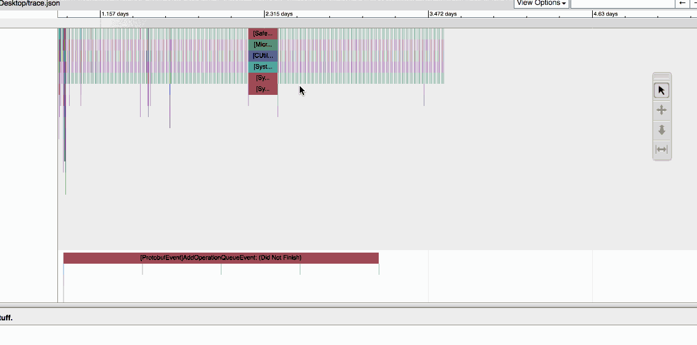

# What is Messier

- `Messier` is an app (contains several components) for `tracing objective-c methods` in an iOS app.
- [中文说明](https://everettjf.github.io/2019/05/06/messier/)




# Typical use-cases

- Instrumentation (performance monitoring, etc.)
- Security audit
- Study obfuscated code
- Just for fun :)


# Components

- Tweak: called Messier in Cydia Repo, used in `Jailbreak` iOS.
- Dylib: messier.framework, used in `Non-Jailbreak` iOS or `Debugging` environment.
- Desktop: installed from Messier.dmg, used to control the endpoint (app that injected by tweak or dylib)

# Latest build

[Latest Build](https://github.com/messier-app/messier/releases)

# Usage

### (1) Desktop

1. Install desktop app `Messier.dmg` from [here](https://github.com/messier-app/messier/releases).
2. If you wish to trace apps on Jailbreak iOS, you could install the tweak as below.
3. If you wish to trace apps under debugger, just config your app depending on the dylib(messier.framework) as below.

### (2) Tweak (Jailbreak)

#### > Install

1. Open `Cydia`.
2. Tap `Sources` -> `Edit` -> `Add`.
3. Input `https://messier.app/cydia` , tap `Add Source`. After reloading the sources, you will see `Messier Repo`.
4. Go into `Messier Repo`, install the tweak `Messier`. (Messier tweak depends on `PreferenceLoader` and `AppList`, so make sure they are installed)

Or manually install from [deb file](https://github.com/messier-app/website/tree/master/cydia/debs/Messier)

#### > Configurations

1. Open `Settings`.
2. Scroll down to the row `Messier`.
3. Enable app in `Enabled Applications`.


### (2) Dylib (Non-Jailbreak)

#### > Install

1. Drag `messier.framework` into `Xcode Targets` -> `Build Phases` -> `Link Binary With Libraries`.
2. Tap `New Copy Files Phase` to add a `Copy Files` phase, drag `messier.framework` into the region, and config `Destination` to `Frameworks`.


#### > Configurations

Normally, no configurations are needed. But there are indeed some. Goto Xcode `Project Scheme` -> `Run` -> `Arguments`, config `Environment Variables` as below.

```
MessierEnableOnAppBoot : true | false
MessierInlineHook : true | false
MessierMainThreadMethodsOnly : true | false
```


### (3) Start Trace

1. Open `Desktop Messier`.
2. Connect iPhone via USB wire.
3. Open app on iPhone.
4. Click `Start` or `Stop` to control the `tracing range`.
5. Click `Fetch` (after `Stop`) to fetch the tracing files, after fetch completed, `trace.json` will be generated in the `~/Documents/MessierWorkspace` directory.
6. Open `Chrome` (or `Chromium`), visit `chrome://tracing`.
7. Drop `trace.json` into.
8. Press `w a s d` to enjoy.


# Q&A

1. How to deal with crash when the app is launching?
    - Go into `Settings` -> `Messier`, try to disable `Inline Hook`.
    - If still not working, create an issue [here](https://github.com/messier-app/messier/issues).
2. Where is the name Messier come from?
    - The [Messier object](https://en.wikipedia.org/wiki/Messier_object) are a set of 110 astronomical objects cataloged by the French astronomer Charles Messier in his Catalogue des Nébuleuses et des Amas d'Étoiles ("Catalogue of Nebulae and Star Clusters")
3. Connected to another app that is not in the foreground?
    - Close(Kill) apps that are enabled Messier, then open the target app that you wish to trace.

# Thanks

- [jmpews/HookZz](https://github.com/jmpews/HookZz)
- [czqasngit/objc_msgSend_hook](https://github.com/czqasngit/objc_msgSend_hook)
- [AloneMonkey/cydiarepo](https://github.com/AloneMonkey/cydiarepo)


# Discussion

- [Join Discussion](./group)

# Contact me

- [everettjf@live.com](mailto:everettjf@live.com)

# Buy me a coffee

- [Buy Me a Coffee](./donate)


# Changelog

1. v0.2 Bugfix
1. v0.1 Messier born in 2019.05
1. v0.0 [AppleTrace](https://github.com/everettjf/AppleTrace) born in 2017.09


# Source code

Sorry, no source code. Messier is free (now, or at least a half year, or forever) but not opensource.

:)


